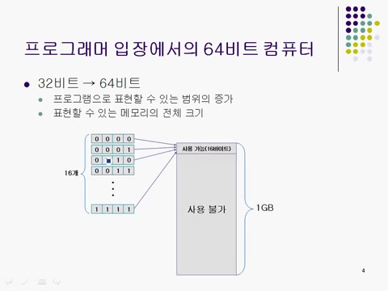
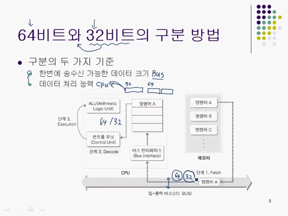
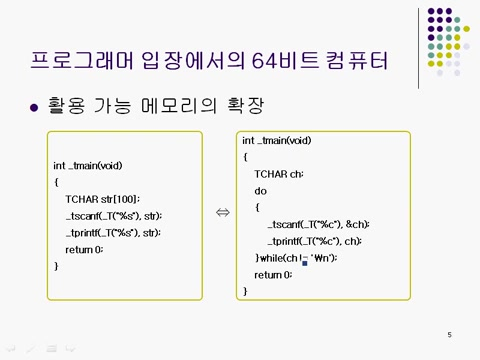
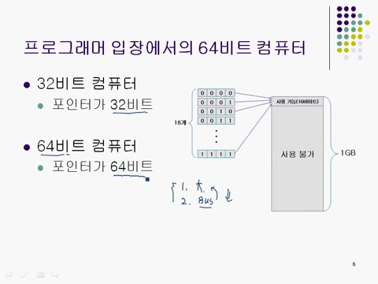

# **제3장\_1 : WIN32 vs WIN64**

### 📌 **32비트 시스템과 64비트 시스템을 구분하는 두 가지 기준은 무엇인가?**

구분하는 기준은 한 번에 송수신 가능한 데이터 크기(버스 용량)과 데이터 처리 능력(CPU가 한번에 읽어들이는 명령어 크기)입니다.

> 💡 포인터 크기가 시스템 비트 수와 일치하는 이유는?
> 포인터 크기가 버스 시스템이 한 번에 송수신할 수 있는 데이터 크기만큼 커야 성능 저하 없이 효율적으로 메모리에 접근할 수 있다.

<strong>📌 핵심용어
</strong>

### ✅ 윈도우 시스템 프로그래밍

- 윈도우 운영체제에서 소프트웨어를 개발하는 과정을 의미한다.
- 응용 프로그램이나 드라이버 등 다양한 소프트웨어를 포함한다.

---

### ✅ 32비트 시스템

- 한 번에 32비트 데이터를 처리할 수 있는 시스템이다.
- 메모리 주소 공간은 최대 약 4GB로 제한된다.

---

### ✅ 포인터

- 메모리 주소를 가르키는 변수다.
- 32비트 시스템에서는 4바이트, 64비트 시스템에서는 8바이트 크기를 가진다.

---

### ✅ 가상 메모리

- 실제 메모리보다 더 많은 메모리를 사용하는 기술이다.
- 필요 시 보조 저장장치를 메모리처럼 활용한다.

---

### ✅ 성능 저하

- 시스템의 작업 속도가 느려지는 현상이다.
- 데이터 처리 능력 저하 또는 메모리 접근 속도 저하로 발생한다.

---

### ✅ 임베디드 시스템

- 특정 기능 수행을 위해 설계된 컴퓨터 시스템이다.
- 제한 된 하드웨어와 소프트웨어 구서으 보통 32/64비트 시스템으로 제작한다.

</detalis>

---

## 목차

1. 📚 32비트 시스템과 64비트 시스템의 기본 이해
2. 🔍 64비트 시스템의 프로그래머 관점에서 의미
3. 🖥️ 포인터 크기와 시스템 성능
4. 🅰️ 32비트와 64비트 시스템의 차이
5. 🖨️ 섹션 종료 및 다음 진행 안내

# 1. 📚 32비트 시스템과 64비트 시스템의 기본 이해

- 32비트와 64비트 시스템을 구분하는 요소는 송수신 가능한 데이터 크기와 데이터 처리 능력 두 가지이다.
- 송수신할 수 있는 데이터 크기는 **버스 시스템**의 비트수에 의존적이고, 32비트와 64비트에 따라 시스템의 성능이 좌우된다.
- 데이터 처리 능력은 CPU의 명령어처리 크기에 의해 결정되고, 32비트 시스템은 32비트 명령어, 64비트 시스템은 64비트 명령어를 일반적으로 한 번에 패치한다.
- 64비트 시스템에서 데이터를 한 번에 64비트로 이동 및 저장, 해석, 처리할 수 있어야 하고, 그렇지 않으면 시스템의 성능이 32비트로 제한될 수 있다.
- CPU또는 데이터 이동 중 어느 하나라도 32비트로 제한될 경우, 병목 현상이 발생해 완벽한 64비트 시스템 성능을 발휘할 수 없다.

# 2. 🔍 64비트 시스템의 프로그래머 관점에서 의미

- 프로그래머는 64비트 시스템이 별로 느껴지지 않지만, 성능 개선을 체감할 수 있다.
- C, C++, 자바 등으로 프로그래밍할 때 32비트와 64비트 간의 방식은 거의 동일하다.
- 32비트 포인터는 4바이트고, 64비트 포인터는 8바이트로 각각의 주소값을 표현할 수 있다.
- 포인터가 크면 처리할 수 있는 주소 범위가 넓어지고, 메모리 접근이 더 유리하다.
- 64비트 시스템에서는 64비트 데이터를 전송, 32비트 시스템은 32비트만 전송할 수 있다.

# 3. 🖥️ 포인터 크기와 시스템 성능

- 포인터의 크기는 크면 클수록 좋지만, 버스의 용량이 제한적일 경우 성능 저하를 초래한다.
- 128비트 포인터를 가진 경우, 64비트 버스는 주소 정보를 두 번에 나눈어 전송해야 하여 시스템 성능을 저하시킨다.
- 32비트 시스템에서 I/O 버스를 두번 사용해야 하고, 주소 전송 시 성능 저하로 이어진다.
- 64비트 시스템에서 64비트 포인터로 데이터 송수신이 성능 향상에 기여한다.

# 4. 🖥️ 32비트와 64비트 시스템의 차이

- 32비트 시스템에서 일반적인 프로그램 구현에 큰 제한이 없으나, 64비트 시스템으로의 전환은 더 많은 메모리 활용을 가능하게 한다.
- 50바이트의 메모리만 있는 시스템에서는 100바이트가 필요한 프로그램이 실행되지 않는다. 최소한 메모리를 활용하는 방법으로 프로그램이 동작할 수 있다.
- 메모리의 제한이 있는 경우, 프로그램에서 한 문자씩 읽는 방식으로 메모리 사용을 최소화 할 수 있다.

# 5. 🅰️ 섹션 종료 및 다음 진행 안내

