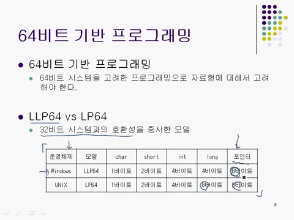
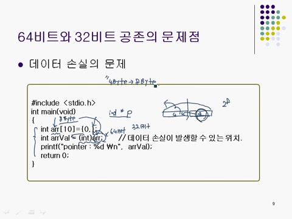
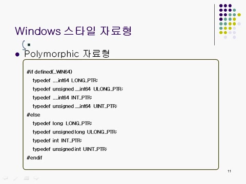

# **제3장\_2 : 프로그램 구현 관점에서 WIN32 vs WIN64 오류확인**

### 📌 **64비트 기반 프로그래밍 시 주의해야 할 점은??**

포인터가 8바이트로 처리되어, 포인터를 기본 자료형으로 캐스팅할 때 메모리 손실이 발생할 수 있어 주의해야 한다.

> 💡 윈도우즈 스타일의 폴리모픽 자료형이란 무엇인가?
> 폴리모픽 자료형은 64비트 기반에서 64비트로, 32비트 시스템에서 32비트로 해석되어 포인터 연산 시 사용된다.

<strong>📌 핵심용어
</strong>

### ✅ 윈도우 시스템 프로그래밍

- 윈도우 운영체제에서 소프트웨어를 개발하는 과정을 의미한다.
- 응용 프로그램이나 드라이버 등 다양한 소프트웨어를 포함한다.

---

### ✅ 32비트 시스템

- 한 번에 32비트 데이터를 처리할 수 있는 시스템이다.
- 메모리 주소 공간은 최대 약 4GB로 제한된다.

---

### ✅ 포인터

- 메모리 주소를 가르키는 변수다.
- 32비트 시스템에서는 4바이트, 64비트 시스템에서는 8바이트 크기를 가진다.

---

### ✅ 가상 메모리

- 실제 메모리보다 더 많은 메모리를 사용하는 기술이다.
- 필요 시 보조 저장장치를 메모리처럼 활용한다.

---

### ✅ 성능 저하

- 시스템의 작업 속도가 느려지는 현상이다.
- 데이터 처리 능력 저하 또는 메모리 접근 속도 저하로 발생한다.

---

### ✅ 임베디드 시스템

- 특정 기능 수행을 위해 설계된 컴퓨터 시스템이다.
- 제한 된 하드웨어와 소프트웨어 구서으 보통 32/64비트 시스템으로 제작한다.

---

## 목차

1. 📚 32비트 시스템과 64비트 시스템의 기본 이해
2. 🔍 64비트 시스템의 프로그래머 관점에서 의미
3. 🖥️ 포인터 크기와 시스템 성능
4. 🅰️ 32비트와 64비트 시스템의 차이
5. 🖨️ 섹션 종료 및 다음 진행 안내

# 1. 📚 64비트 기반 프로그래밍의 이해

- 64비트 기반 프로그래밍은 LLP64 모델을 따르고, 데이터 타입의 크기를 재구성하는 것이 필요하다.
- 윈도우즈에서의 데이터 타입 크기는 캐릭터 1바이트, 쇼트 2바이트, 인트와 롱 4바이트, 포인터는 8바이트로 정의된다.
- 기존의 32비트 시스템과의 호환성을 위한 디자인으로, 64비트 프로그래밍이 이전과 크게 다른 점이 없다는 점을 강조할 수 있다.

# 2. 🔍 64비트 시스템의 포인터사용 주의사항

- 64비트 기반 프로그래밍에서 포인터의 크기가 **8바이트**라는 점을 반드시 유의해야 한다.
- 일반적으로 배열 이름은 포인터로 인식되고, 배열 이름도 8바이트로 처리된다.
- 32비트 시스템에서 포인터와 int형 자료형이 돌일한 크기인 4바이트로 문제가 발생하지 않고, 64비트 시스템에서 **형 변환**이 문제를 일으킬 수 있다.
- 8바이트의 포인터를 4바이트로 캐스팅하면 실제 메모리 주소를 잘못 참조하여 메모리 손실이 발생할 수 있다.
- 64비트 및 32비트 시스템에서 포인터를 기본 자료형으로 캐스팅하지 않는 것이 올바른 프로그래밍 스타일이다.

# 3. 🖥️ 윈도우즈 자료형의 이해와 참조 방법

- 64비트 시스템에서 **새롭게 등장한 자료형**에 대한 정의가 있고, 사용자는 이를 참고하여 필요한 자료형을 선택해 사용할 수 있다.
- 자료형을 일일이 외울 필요는 없고, 사용자가 필요할 때 자연스럽게 참조하면 된다.
- 예로, `int64` 자료형은 `__int64`로 선언되어 있고, 이는 64비트 정수형임을 나타낸다.

# 4. 🖥️ 다형성과 폴리모픽 자료형 개념

- **다형성**은 하나의 사물이 여러 가지 특성을 지닐 수 있는 성질, 예를 들어 한 사람이 직장에서 과장, 집에서는 가장으로서 역할을 수행할 수 있음을 보여준다.
- **폴리모픽 자료형**은 다형적 특성을 지니고, 상황에 따라 다르게 보일 수 있는 자료형을 정의한다.
- 시스템에서 `__WIN64` 매크로가 정의되고, 자료형이 64비트로 정의되고, 정의되지 않을 경우 321비트로 처리된다.
- 폴리모픽 자료형이 포인터타입이 아니다.

# 5. 🅰️ 윈도우즈 시스템에서 오류 확인 방법

- 오류 발생 시, 그 이유를 알아야 하고 이는 오류 수정이나 프로그램 흐름 분기에 필요하다.
- 윈도우즈에서 오류 발생 시 전역 변수에 그 이유를 저장하고, 전역변수에 접근하는 함수는 get last error이다.
- 오류를 확인하는 함수의 호출 순서는 중요하고, 오류 발생 후 즉시 get last error 함수를 호출해야 값을 정확히 확인할 수 있다.
