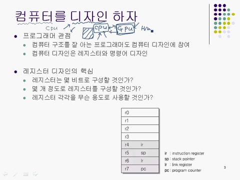
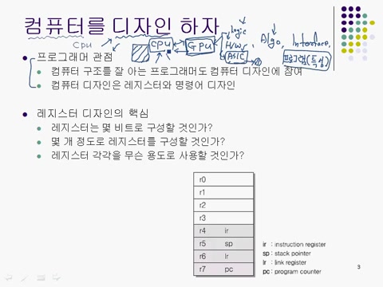
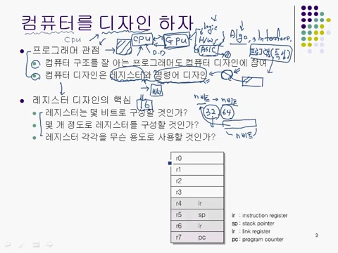

# **제4장\_1 : 컴퓨터 구조의 접근방법(1)**

### 📌 **컴퓨터 디자인을 프로그래머 관점에서 접근하는 방법은?**

프로그래머는 컴퓨터 디자인에 참여하며, 특히 레지스터 디자인과 명령어 디자인을 주로 담당한다.

> 💡 레지스터 핵심 질문 3가지?
> 레지스터는 몇 비트로 구성할 것 인가?
> 몇 개 정도로 레지스터를 구성할 것인가?
> 레지스터 각각을 무슨 용도로 사용할 것인가?

<strong>📌 핵심용어
</strong>

### ✅ 컴퓨터 구조 개념

- 컴퓨터 시스템의 구성 요소(CPU, 메모리, I/O 등)의 연결 및 작동원리.
- 건축 설계도처럼 전체 시스템 구조를 나타낸다.

---

### ✅ CPU 및 명령어 관련

- **CPU 디자인** : 연산과 제어를 수행하는 두뇌 설계.
- **레지스터** : CPU 내부의 임시 저장소 (종류: 범용, 스택 포인터, 링크, 인스트럭션, 프로그램 카운터 등).
- **명령어 디자인/집합** : CPU가 이해할 수 있는 작업 지시서의 구성.
- **레지스터 셋** : CPU 내부의 레지스터들의 집합.
- **비트 수** : 시스템이 정보를 처리하는 단위 (ex. 32비트 vs 64비트).

---

### ✅ 메모리 및 가상화

- **가상 메모리** : 보조 저장장치를 실제 메모리처럼 사용하는 기술.
- **스택 포인터** : 스택 메모리 내 현재 위치 추적.

---

### ✅ 시스템 구성 요소

- **컴파일러** : 고급 언어 -> 기계어 변환.
- **프로그래밍 언어** : 컴퓨터에게 명령 전달(C, Java, Python 등).
- **시스템 아키텍처** : CPU, 메모리, I/O 간 구조적 관계.
- **레지스터 용도** : 특정 연산 목적에 따라 구분된 레지스터.

---

### ✅ 하드웨어 및 설계

- **로직 설계** : 회로 동작을 위한 논리 설계.
- **ASIC (에이직)** : 특정 목적에 최적화된 맞춤형 회로.
- **베릴로그** : 하드웽저 설계를 위한 언어.

---

### ✅ 입출력 및 그래픽 관련

- **그래픽 카드/GPU** : 이미지 처리 및 화면 출력.
- **그래픽 알고리즘** : 화면 렌더링, 광원 처리 등 수학적 기법.

---

### ✅ 시스템 전문가 및 인터페이스

- **하드웨어 전문가** : 물리적 장치 개발.
- **인터페이스 전문가** : 하드웨어/소프트웨어 간 연결 설계.
- **디바이스 드라이버** : 운영체제 <-> 하드웨어 소통 중개자.

---

### ✅ ARM 및 가상 시스템

- **ARM 프로세서** : 저전력 모바일 프로세서.
- **가상 컴퓨터** : 소프트웨어로 구현된 모의 컴퓨터 환경.

---

</detalis>

---

## 목차

1. 📚 컴퓨터 구조와 CPU 디자인 접근 방법
2. 🔍 하드웨어 설계와 전문가의 역할
3. 🖥️ 포인터 크기와 시스템 성능
4. 🅰️ 32비트와 64비트 시스템의 차이
5. 🖨️ 섹션 종료 및 다음 진행 안내

# 1. 📚 컴퓨터 구조 심화 학습

- CPU 공부 방식으로 직접 가상의 컴퓨터를 디자인하는 방식을 채택할 예정이다.
- CPU는 여러 종류가 존재하고, 디자인하는 방식에 따라 수십에서 수백 개로 나뉘어진다.

# 2. 🔍 하드웨어 설계와 전문가의 역할

- 하드웨어 설계를 위한 "베릴로그"를 이용하여 CPU 디자인을 수행한다.
- 베릴로그는 C언어와 유사하고, 디자인된 코드는 자동적으로 논리 게이트 단위로 변환된다.

# 3. 🖥️ 레지스터 디자인의 기본 구성 요소

- CPU 디자인시 프로그래머는 디바이스 드라이버를 직접 만들고, 문제 해결 능력이 향상된다.
- 레지스터 디자인, 명령어 디자인을 책임지고, 컴파일러를 통해 명령어의 집합으로 이해된다.
- 레지스터의 비트 수는 시스템의 비트 수와 일치하고, 일반적으로 N비트로 설정하는 것이 표준이다.

# 4. 🖥️ 레지스터의 구성과 용도

- 레지스터는 특별한 목적을 가진 메모리 장치, 렘이나 하드디스크와는 다르게 특별히 설계된 저장 공간이다.
- 총 여덟 개의 레지스터가 있고, 각각의 용도를 정함으로 속도향상이 이루어진다.
- 레지스터 이름은 R0 ~ R7까지고, R4 ~ R7까지 특정 용도로 지정되어 인스트럭션 레지스터(IR), 스택 포인터(SP), 링크 레지스터(LR), 프로그램 카운터(PC)로 사용한다.
- R0 ~ R3는 범용 레지스터로 연산에 필요한 데이터를 저장하는 역할을 한다.
