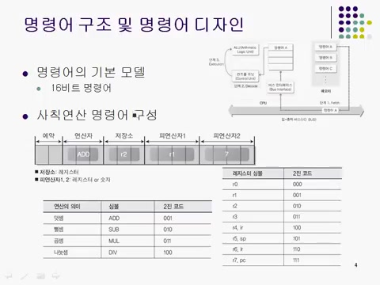
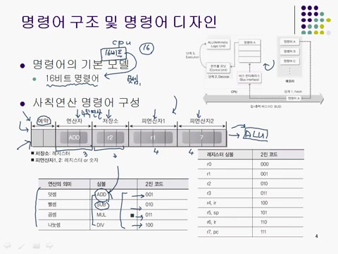
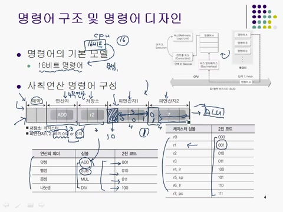
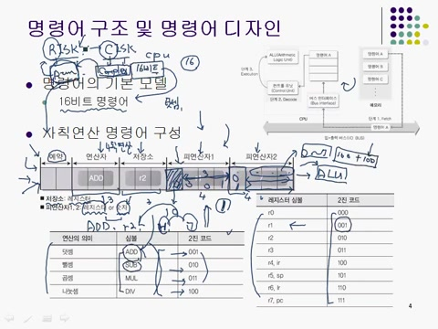

# **제4장\_2 : 컴퓨터 구조의 접근방법(2)**

### 📌 **RISC와 CISC CPU의 차이점은?**

RISC는 명령어가 단순해 모든 명령어가 패치, 디코드, 익스큐션의 3단계를 거쳐 실행되도록 디자인되어 있고, 고성능 CPU에 적합하다. CISC는 명령어가 복잡하나 다양한 형태로 조합이 가능하나 속도 향상에 제한적이다.

> 💡 RISC 구조에서 명령어 5개를 실행하는데 필요한 쿨럭 수는??
> 명령어 5개를 실행하는 데[ 총 7클럭이 필요하다.]

<strong>📌 핵심용어
</strong>

### ✅ 레지스터

- CPU안에 있는 아주 작은 저장 공간. CPU가 데이터를 꺼내 쓰고 저장할 수 있도록 도와준다.

---

### ✅ 16비트 시스템

- 컴퓨터가 한 번에 처리할 수 있는 데이터의 크기가 16비트라는 의미.

---

### ✅ 명령어

- 컴퓨터에게 무엇을 해라라고 지시하는 코드, 상세 설명서이다.

---

---

## 목차

1. 📚 16비트 시스템과 명령어 구조
2. 🔍 명령어 디자인과 CPU 구조
3. 🖥️ 연산자와 레지스터 디자인의 문제점
4. 🅰️ 리스크와 시스크 CPU 구조의 차이점
5. 🖨️ RISC 구조의 이점

# 1. 📚 16비트 시스템과 명령어 구조

- 16비트 레지스터와 명령어의 디자인은 CPU 구조에 있어서 기본적이고, 명령어의 길이도 16비트여야 한다.
- 명령어는 간단한 사칙연산 외에도 복잡한 정보를 담고 있고, 연산의 종류, 결과 저장소 및 피연산자에 대한 정보를 포함한다.
- 하나의 명령어안에는 다양한 정보가 묶여있고, 이는 CPU의 효율적인 작동을 위해 필수적이다.

# 2. 🔍 명령어 디자인과 CPU 구조

- 명령어의 구성 요소에는 피연산자 정보가 포함되어 있다.
- ALU는 명령어를 해석하고, 수행활 작업을 결정하는 요소이다.
- CPU 디자인은 하드웨어 뿐만 아니라 소프트웨어전문가의 참여로 이루어져야 한다는 점을 강조한다.
- 사칙연산을 위한 명령어 디자인에서, 각 연산자에 대해 4비트를 사용, 각 피연산자는 2개를 필요로 한다.
- 명령어에 따라 피연산자의 조합과 저장소비트 수가 달라질 수 있고, 이는 명령어설계에 따라 결정된다.

# 3. 🖥️ 연산자와 레지스터 디자인의 문제점

- Add, Sub, Mul, Divide와 같은 연산자가 올 수 있도록 시스템이 디자인되었다.
- **레지스터**에 연산 결과를 저장하도록 제한, 이는 CPU의 실제 동작 방식을 반영한다.
- 총 8개의 레지스터를 다루기 위해 3비트를 할당하여 레지스터정보를 표현할 수 있다.
- 피연산자는 레지스터또는 숫자가 될 수 있지만, **4비트**로 표현할 수 있는 숫자의 범위가 제한적이라는 문제점이 존재한다.
- 레지스터와 숫자를 구분하기 위해 비트를 약속한다.

# 4. 🖥️ 리스크와 시스크 CPU 구조의 차이점

- **네 개의 비트**로 숫자를 표현, 0부터 7까지 표현이 가능하나 **더 큰 연산**이 필요한 경우 문제가 발생한다. 100 더하기 100과 같은 연산을 어떻게 할 것인지에 대한 연구가 필요하다.
- 명령어는 단순하게 구성하며, 이를 통해 **리스크(RISC)**와 **시스크(CISC)** CPU구조를 설명할 수 있다.
- 리스크 CPU는 명령어가 단순화, 복잡한 명령어시스템을 가질 필요 없이 필요한 기능을 제공한다.
- 시스크 CPU는 명령어가 복잡하고 다양한 형태를 제공, 그로 인해 프로그래머가 프로그래밍할 때 편리함을 느낄 수 있다.
- 리스크 CPU 구조는 제한 사항이 있고, 명령어 조합의 다양성이 적기 때문에 특정 상황에서는 활용에 제약이 있을 수 있다.

# 5. 🅰️ RISC 구조의 이점

- **RISC**구조는 CPU의 성능을 향상시키기 위해 필수적이고, 현대의 대부분 CPU가 이러한 구조를 채택한다.
- 명령어처리 과정은 **패치, 디코드, 익스큐션**의 세 단계로 이루어지고, 각 단계에서 1클럭이 소모된다.
- RISC 구조의 장점은 명령어를 단순화하여, 명령어 실행 시 각 단계가 동시에 진행될 수 있도록 디자인 된다는 점이다.
- n개의 명령어를 처리할 때 필요한 클럭수는 n + 2로, 이는 RISC구조가 기존 시스크보다 적은 클럭수로 동일한 작업을 수행할 수 있음을 의미한다.
- RISC구조는 적은 열을 발생시키고, 낮은 클럭수로도 많은 명령어를 효율적으로 실행할 수 있도록 설계되어 있다.
